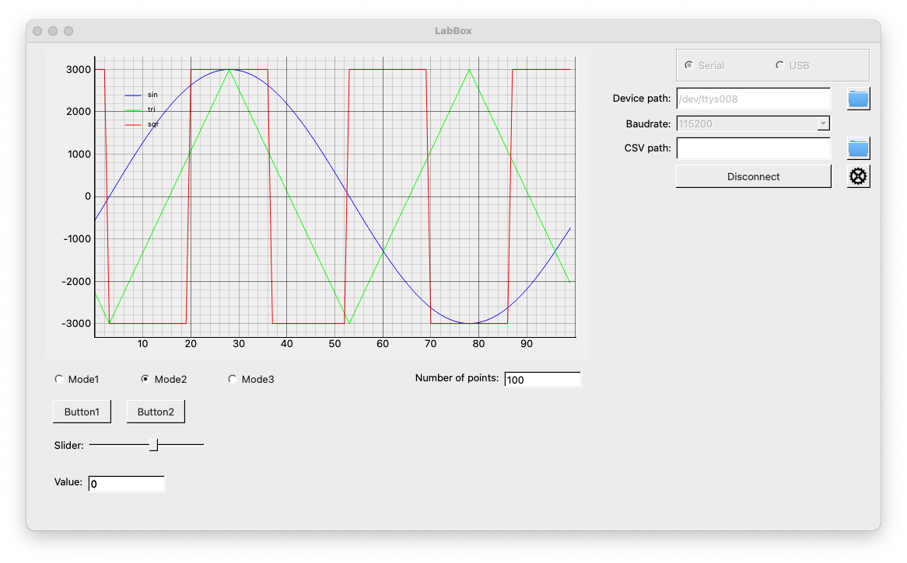

# LabBox

LabBox is a PyQt-based tool that is mainly used to play&learn and monitor any activity related to a microcontroller. For
more information please refer to our [Wiki page](https://github.com/swag-engineering/labbox/wiki).



To install the project :

``` shell
python3 -m venv .venv
. .venv/bin/activate
python -m pip install -U pip
pip install 'labbox @ git+https://github.com/swag-engineering/labbox'
labbox
```  

We recommend to use venv, since we are using very specific versions of required packages. You will also get installed
*labbox-generator* script, it could be used to test plotting functionality of the LabBox. To check generator's options
run:

``` shell
labbox-generator --help
```  

For example to plot three signals you can try:

``` shell
labbox-generator -b 115200 -f "1;2;3" -s "sin;tri;sqr"
```  

In that case sine signal will have frequency of 1 Hz, triangular signal 2 Hz and square signal 3 Hz correspondingly.

#### Possible problems

In case you are getting error 'Device file: Read and/or write permission denied!' you need either to change udev rules
or just:

``` shell
sudo chown <user name> <path to device file>
```